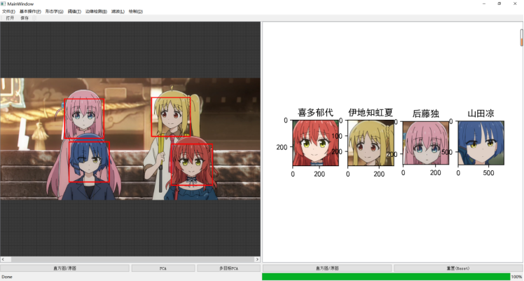

# Picture-Processing-with-GUI 

### 带界面的图像处理软件

此项目为大三上学期的课程设计，带有GUI界面界面的图像处理软件，同时还有基于PCA人脸识别功能，数据集在目录中可以找到，标签在程序中定义。值得一提的是，本来我觉得这个小项目做的挺好的，琢磨PyQt类继承重写上花了挺多功夫的，但是报告写偏题了 :(



[![Contributors][contributors-shield]][contributors-url]
[![Forks][forks-shield]][forks-url]
[![Stargazers][stars-shield]][stars-url]
[![Issues][issues-shield]][issues-url]
[![MIT License][license-shield]][license-url]


## 目录

- [上手指南](#上手指南)
  - [开发前的配置要求](#开发前的配置要求)
  - [安装步骤](#安装步骤)
- [部署](#部署)
- [文件目录说明](#文件目录说明)
- [版本控制](#版本控制)
- [作者](#作者)
- [鸣谢](#鸣谢)


### 上手指南

###### 开发前的配置要求

1. OpenCV
2. Python
2. Anaconda

###### **安装步骤**

```sh
git clone https://github.com/Son4ta/Picture-Processing-with-GUI.git
```


### 部署

```sh
python ./GUI/GUI.py
```


### 文件目录说明

根目录下有课程报告和各种图像处理算法验证程序，主程序在GUI文件夹中，Data中有数据集和测试集，还有一个调试用隔离文件夹

```
filetree 
├─.idea
│  └─inspectionProfiles
├─classification
├─Data	
│  ├─0
│  ├─1
│  ├─2
│  ├─3
│  ├─4
│  ├─5
│  ├─6
│  ├─7
│  ├─insulate
│  │  ├─10
│  │  ├─11
│  │  ├─8
│  │  └─9
│  └─Test
│      ├─0
│      ├─1
│      └─4
├─GUI
│  └─__pycache__
├─img
└─__pycache__

```


### 版本控制

该项目使用Git进行版本管理。您可以在repository参看当前可用版本。


### 作者

Son4ta@Son4ta

知乎:Son4ta&ensp; qq:1152670339

 *您也可以在贡献者名单中参看所有参与该项目的开发者。*


### 版权说明

该项目签署了MIT 授权许可，详情请参阅 [LICENSE.txt](https://github.com/Son4ta/Picture-Processing-with-GUI/blob/master/LICENSE.txt)


### 鸣谢


- [GitHub Emoji Cheat Sheet](https://www.webpagefx.com/tools/emoji-cheat-sheet)
- [Img Shields](https://shields.io)
- [Choose an Open Source License](https://choosealicense.com)
- [GitHub Pages](https://pages.github.com)
- [Animate.css](https://daneden.github.io/animate.css)

<!-- links -->

[your-project-path]:Son4ta/Picture-Processing-with-GUI
[contributors-shield]: https://img.shields.io/github/contributors/Son4ta/Picture-Processing-with-GUI.svg?style=flat-square
[contributors-url]: https://github.com/Son4ta/Picture-Processing-with-GUI/graphs/contributors
[forks-shield]: https://img.shields.io/github/forks/Son4ta/Picture-Processing-with-GUI.svg?style=flat-square
[forks-url]: https://github.com/Son4ta/Picture-Processing-with-GUI/network/members
[stars-shield]: https://img.shields.io/github/stars/Son4ta/Picture-Processing-with-GUI.svg?style=flat-square
[stars-url]: https://github.com/Son4ta/Picture-Processing-with-GUI/stargazers
[issues-shield]: https://img.shields.io/github/issues/Son4ta/Picture-Processing-with-GUI.svg?style=flat-square
[issues-url]: https://img.shields.io/github/issues/Son4ta/Picture-Processing-with-GUI.svg
[license-shield]: https://img.shields.io/github/license/Son4ta/Picture-Processing-with-GUI.svg?style=flat-square
[license-url]: https://github.com/Son4ta/Picture-Processing-with-GUI/blob/master/LICENSE.txt


